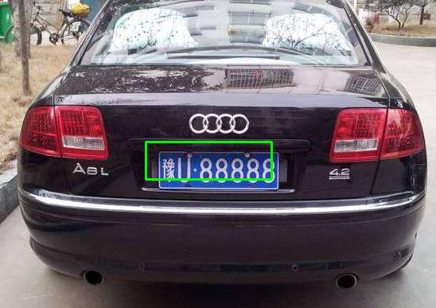

# <strong>车牌识别使用方法</strong>
## **1. 创建工作空间**

<font  size=4 face="宋体">找一个地方存放工程，用以下代码创建一个carid工作空间（carid可以替换为其他名称）：</font>

```
$ mkdir -p〜/ carid / src
$ cd〜/ carid /
$ catkin_make
```

<font  size=4 face="宋体">将license_plate_recognition文件拷贝到 carid/src目录下，重新编译catkin工作空间</font>

```
# In your catkin workspace
$ cd ../carid
$ catkin_make
$ cd -
```

<font  size=4 face="宋体">此时的catkin工作空间应该如下所示：</font>

```
#这里只标注出重要的文件其它文件用...表示
carid/           -- WORKSPACE
		build/
				...
		devel/
				...
        src/  
            	CMakeLists.txt 
            	license_plate_recognition/
            			CMakeLists.txt
            			package.xml
            			...
            			scripts/ 
            				carid_rec.py                             --服务节点（Service Node）
            				carid_rec_send_test.py      --客户端节点（Client Node）
            				carid_recongnition               --用于车牌识别的功能文件
            			srv/
            				carsrv.srv                                  --服务节点和客户端之间传递信息的格式
```


## **2. 启动Service Node和Client Node**

<font  size=4 face="宋体">首先启用roscore：</font>

```
#用快捷键ctrl+alt+t可以打开终端
$ roscore
```

<font  size=4 face="宋体">打开一个新的终端，将终端cd到carid工作空间下：</font>

```
#文件名要与1.中创建的工作空间名一致
$ cd ~/carid
```

<font  size=4 face="宋体">使用以下代码启用</font>Service Node：

```
$ . devel/setup.bash
$ . rosrun license_plate_recognition carid_rec.py 
```

可以看到Service端显示：

```
Ready to recognize license plate.
```

<font  size=4 face="宋体">再打开一个新的终端，将终端cd到carid工作空间下：</font>

```
#文件名要与1.中创建的工作空间名一致
$ cd ~/carid
```

<font  size=4 face="宋体">使用以下代码启用Client Node：</font>

```
$ . devel/setup.bash
$ . rosrun license_plate_recognition carid_rec_send_test.py
```

<font  size=4 face="宋体">此时就可以在Client端得到服务器返回的结果。可以看到：</font>

```
client get image
豫U88888
```

<font  size=4 face="宋体">并且显示如下图片，按任意建退出。</font>

<div align=center></div>

<font  size=4 face="宋体">而Service端显示如下：</font>

```
success get the req!
(1, 3, 387, 548)
183 178 341 225
[['豫U88888', 0.9744877389499119, [183, 178, 341, 225]]]
```

## **3. Service Node的接收与发送**

<font  size=4 face="宋体">Service端接收与发送数据的格式存储在了carid/src/license_plate_recognition/srv的carsrv.srv里面，内容如下：</font>

```
std_msgs/Header header
sensor_msgs/Image image
---
string carid
uint32 left
uint32 top
uint32 right
uint32 bottom
```

<font  size=4 face="宋体">Service端接收的格式是：</font>

```
std_msgs/Header header
sensor_msgs/Image image
```

<font  size=4 face="宋体">这个格式被定义在carid/devel/lib/python2.7/dist-packages/license_plate_recognition/srv中的_carsrv.py中的carsrvRequest类：</font>

<font  size=4 face="宋体">这个类有两个属性：</font>

```
self.header
self.image
```

<font  size=4 face="宋体">第一个是头文件可以不用管，第二个是一个Image类别的数据，可以通过调用sensor_msgs中msg下的Image进行实例化。Image的属性如下：</font>

```
# This message contains an uncompressed image
# (0, 0) is at top-left corner of image
#

Header header        # Header timestamp should be acquisition time of image
                     # Header frame_id should be optical frame of camera
                     # origin of frame should be optical center of cameara
                     # +x should point to the right in the image
                     # +y should point down in the image
                     # +z should point into to plane of the image
                     # If the frame_id here and the frame_id of the CameraInfo
                     # message associated with the image conflict
                     # the behavior is undefined

uint32 height         # image height, that is, number of rows
uint32 width          # image width, that is, number of columns

# The legal values for encoding are in file src/image_encodings.cpp
# If you want to standardize a new string format, join
# ros-users@lists.sourceforge.net and send an email proposing a new encoding.

string encoding       # Encoding of pixels -- channel meaning, ordering, size
                      # taken from the list of strings in include/sensor_msgs/image_encodings.h

uint8 is_bigendian    # is this data bigendian?
uint32 step           # Full row length in bytes
uint8[] data          # actual matrix data, size is (step * rows)
```

<font  size=4 face="宋体">我在Client端（carid_rec_send_test.py）使用以下代码设置需要发送的数据：</font>

```python
#调用Image类
from sensor_msgs.msg import Image
#调用carsrvRequest类
from _carsrv import carsrvRequest
#通过publish_image定义一个Image对象imagedata
imagedata = publish_image(img)
#实例化一个carsrvRequest对象image_send
image_send=carsrvRequest()
#为image_send的image属性赋值
image_send.image=imagedata
```

<font  size=4 face="宋体">再通过rospy.ServiceProxy向Service发送数据，并接收Service返回的数据：</font>

```python
carid_rec_srv = rospy.ServiceProxy('carid_rec_srv', carsrv)#()中分别表示srv传递时的名字和格式
resp = carid_rec_srv(srv_send)
```

<font  size=4 face="宋体">Service端返回的数据格式是：</font>

```
string carid
uint32 left
uint32 top
uint32 right
uint32 bottom
```

<font  size=4 face="宋体">通过rospy.Service传递回Client端，代码如下：</font>

```python
#Automatic_license_plate_recognition为返回Client端的数据，数据之间用，隔开。
s = rospy.Service('carid_rec_srv', carsrv, Automatic_license_plate_recognition)
def Automatic_license_plate_recognition(req):
	#req是Service端接收到的数据，也是上文中的提到的carsrvRequest类定义的对象
    image_data = np.frombuffer(req.image.data, dtype='uint8').reshape((req.image.height, req.image.width, 3))
    print("success get the req!")
    car_inf=recognition_carid(image_data)
    #return srv response
    return carsrvResponse(car_inf[0][0],car_inf[0][2][0],car_inf[0][2][1],car_inf[0][2][2],car_inf[0][2][3])
```

<font  size=4 face="宋体">以上就是所有代码中用到的数据格式和传递方法</font>